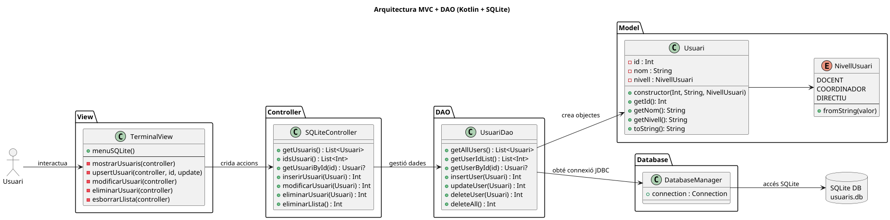
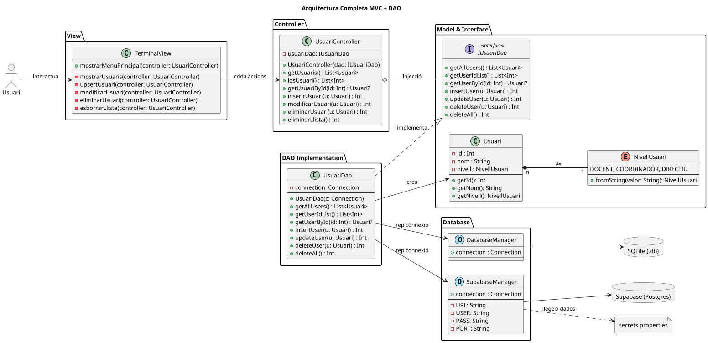

# Contingut

## Arquitectura del Projecte
El projecte segueix l'arquitectura de desenvolupament per capes segons el **patró MVC** i el **patró DAO (Data Access Object)** per a garantir una *Clean Architecture*.
Així, el codi està organitzat en paquets on cadascun té una responsabilitat única, minimitzant la interdependència.

> [!TIP]
> Aquesta separació permetria, per exemple, substituir la `TerminalView` per una interfície gràfica (GUI) sense haver de modificar la lògica del controlador ni l'accés a dades.

---

## Persistència de Dades

### 1. SQLite Local (branca 'main')
S'utilitza una base de dades local en format `.db` gestionada mitjançant **JDBC**.
- **Fitxer**: Ubicat a la carpeta del projecte.
- **Gestió**: La classe `DatabaseManager` s'encarrega d'establir la connexió.
- **Classes Clau**:
    - **DriverManager**: Per obtenir la connexió mitjançant la *connection string*.
    - **Statement / PreparedStatement**: Per executar consultes SQL de forma segura.
    - **ResultSet**: Utilitzat com a buffer per llegir les dades retornades de la consulta.



### 2. Supabase - PostgreSQL Remot (branca 'main-supabase')
El projecte està preparat per connectar-se a una base de dades **PostgreSQL** allotjada al núvol mitjançant **Supabase**.
- **Gestió**: La classe `SupabaseManager` gestiona la connexió remota.
- **Seguretat**: Les credencials (URL, PORT, USER, PASS) es llegeixen des d'un fitxer extern anomenat `secrets.properties` per evitar exposar dades sensibles al repositori.
- **Connexió**: Es fa ús del driver oficial de PostgreSQL configurat per defecte al port **5432** (o 6543 per a pooling).


---

# Especificacions Tècniques

## Llenguatge i Entorn
- **Llenguatge**: Kotlin Multiplatform
- **IDE**: IntelliJ IDEA amb **Gradle** (SDK 20)

## Dependències (build.gradle.kts)
Per al correcte funcionament dels drivers JDBC, el fitxer `build.gradle.kts` inclou les següents llibreries:

### SQLite
```kotlin
implementation("org.xerial:sqlite-jdbc:3.36.0.3")
    
    // Driver per a PostgreSQL (Supabase)
    implementation("org.postgresql:postgresql:42.6.0")
}
```

## Gestió de Variables d'Entorn
Per poder llegir el fitxer secrets.properties i mapejar-lo a variables d'entorn de manera senzilla:

```kotlin
dependencies {
// Llibreria per gestionar fitxers .env / .properties
implementation("io.github.cdimascio:dotenv-kotlin:6.4.1")
}
```

> [!IMPORTANT]
> Recorda crear el fitxer secrets.properties a l'arrel del projecte amb el següent format:

```
supabase.url=la_teva_url_de_supabase
supabase.user=postgres
supabase.passl=la_teva_contrasenya
supabase.port=5432 o 6543
```

> [!NOTE]
> Aquest projecte ja inclou aquestes dependències configurades; no és necessari afegir-les manualment si ja s'ha realitzat la sincronització de Gradle.
